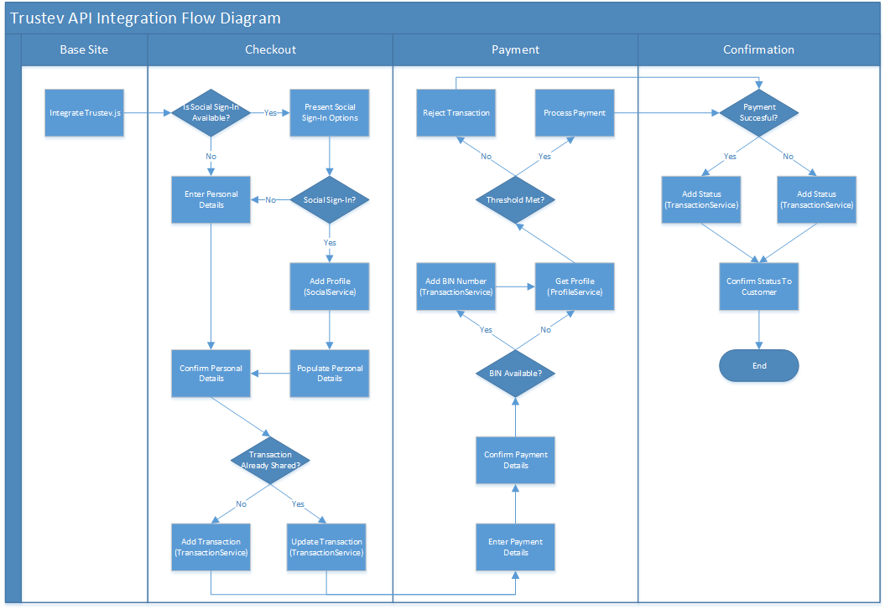

##1.0 API Introduction
======================

## Sample Integration Checkout Flow
=========================

</img>

### 1.1 Response Codes

The Trustev API returns standard HTTP codes in the response header. Additional information is available in the HTTP response message header.

### 1.2 API Formats

The following formats are applicable when interacting with the Trustev API. Please note that certain formats are different when using a JSON content type, as opposed to a content type of XML. These are highlighted in the table below.

<table>
 <tr><th width=308 align=left> 
             Type               </th><th width=308 align=left>   
                                              Format                      </th><th width=308 align=left> 
                                                                                            Notes                 </th></tr>
 <tr><td>    DateTime                        </td><td>     YYYY-MM-DD hh:mm:ss (SOAP) Milliseconds since EPOCH (JSON)         </td><td>         Must always be UTC    </td></tr>
 <tr><td>    DateTime -> String              </td><td>     YYYYMMDDhhmmss              </td><td>         Must alwayys be UTC   </td></tr>
 <tr><td>    SocialNetworkType               </td><td>     0 = Facebook 1 = Twitter 2 = LinkedIn 3 = Trustev</td><td>         Enumerator            </td></tr>
 <tr><td>    AddressType                     </td><td>     0 = Standard 1 = Billing 2 = Delivery           </td><td>         Enumerator            </td></tr>
 <tr><td>    StatusType                      </td><td>     0 = Init 1 = Placed 2 = Refunded  
                                                           3 = Rejected 4 = Fulfilled 
                                                           5 = Completed 6 = Refreshed 
                                                           7 = Payment                     </td><td>         Enumerator            </td></tr>
 <tr><td>    ReasonType                      </td><td>     0 = System 1 = Fraud 2 = Complaint 
                                                           3 = Remorse 4 = Other              </td><td>         Enumerator            </td></tr>
 <tr><td>    TrustevProfileScoreSource       </td><td>     0 = Address 
                                                           1 = Behaviour 
                                                           2 = Device 
                                                           3 = Email 
                                                           4 = Facebook  
                                                           5 = IP 
                                                           6 = Transaction 
                                                           7 = Trustev 
                                                           8 = Velocity                             </td><td>         Enumerator            </td></tr>
 <tr><td>    TrustevProfileScoreParameter    </td><td>     0 = Overall 
                                                           1 = Billing 
                                                           2 = Delivery 
                                                           3 = Input 
                                                           4 = Domain 
                                                           5 = Address 
                                                           6 = IP 
                                                           7 = Proxy 
                                                           8 = VPN 
                                                           9 = Value 
                                                           10 = Velocity 
                                                           11 = Legitimacy 
                                                           12 = Pattern 
                                                           13 = Hustle</td><td>         Enumerator            </td></tr>
</table>

### 1.3 Phased Integration

During our initial integration efforts with our early partners, Trustev are promoting a phased integration approach.
This phased approach ensures that your integration with Trustev goes as smoothly as possible, and allows us to
assist with you any issuees prior to go live.

The integration of Trustev into your site is completed using a simple 3 stage process:

<b>Phase 1</b>

Phase 1 involves integrating our simple JS module into your site, and letting this data collection engine 
run for  about 2 weeks. No decisions are made in this phase. This ensures that no JS modules conflict with 
already used libraries, and allows Trustev to get a profile of the type of customer the interacts with your 
site. This data collection helps us to tweak any weightings & thresholds together with you, and ensures 
appropriate scoring when you turn Trustev decisioning on.

<b>Phase 2</b>

Phase 2, which also typically runs for 2 weeks, is our API integration. This involves integrating with our 
social and transaction APIs for 2 weeks to ensure that the most suitable data is being shared. It also allows 
Trustev to build up an accurate profile of the type of transactions being run through your site. A Trustev 
score is returned, but we would not expect you to alter a customer's experience or checkout based on this.

<b>Phase 3</b>

Phase 3 is essentially where the whole Trustev system is turned on, and you can allow or block customers based 
on the Trustev score. At this point, Trustev has an accurate profile of your customers, and has confidence 
that the integration has worked as expected.

##2.0 Authentication API
========================

The Trustev API is secured using Token Authentication. Where an API method requires authentication, a valid token must be provided. Any API method that requires authentication is clearly marked.

Details of how to retrieve a token are below. Your Username, Password and Application Secret are all available on the Trustev Developer Portal.

### 2.1 Getting a Token

#### 2.1.1 Format

<table>                        
 <tr><td width=308>    URL                      </td><td>    https://api.trustev.com/v1.1/AuthenticationService.svc/rest/Token</td></tr>
 <tr><td>              Authentication Required  </td><td>    No                                                 </td></tr>
 <tr><td>              Format                   </td><td>    JSON                                               </td></tr>
 <tr><td>              Method                   </td><td>    POST                                               </td></tr>
</table>

#### 2.1.2 Request 

      {
        "request": 
        {
          "UserName" : String,
          "Password" : String,
          "Sha256Hash" : String,
          "Timestamp" : DateTime 
        }
      }

#### 2.1.3 Response

      {
        "Message" : String,
        "Code" : Int,
        "Timestamp" : DateTime,
        "Token" : 
        {
          "APIToken" : String,
          "ExpireAt" : DateTime
        }
      }
#### 2.1.4 Creating the Password Hash

The generation of the hashed value required for the Password parameter of the request object is a 2 stage process. This process is as follows:

##### <i>Stage 1</i>

Create a Sha256Hash of a string in the format of {0}.{1} where {0} is the timestamp being sent in the request (transformed to a string in the specified format DateTime -> String), and {1} your password.

##### <i>Stage 2</i>

Create a Sha256Hash of a string in the format of {0}.{1}, where {0} is the result of Stage 1, and {1} is your Application Secret.

#### 2.1.5 Creating the Request Hash

The generation of the hashed value required for the Sha256Hash parameter of the request object is a 2 stage process. This process is as follows:

##### <i>Stage 1</i>

Create a Sha256Hash of a string in the format of {0}.{1} where {0} is the timestamp being sent in the request (transformed to a string in the specified formatDateTime -> String), and {1} your username.

##### <i>Stage 2</i>

Create a Sha256Hash of a string in the format of {0}.{1}, where {0} is the result of Stage 1, and {1} is your Application Secret.

### 2.2 Using a Token

Each Token generated is valid for 1 hour from the time of creation. The expiration time of the token is specified in the Token object returned with a successful GetToken call.

When calling a method or service that requires authentication, you must include a valid token, and your username in the X-Authorization header of the request.

For example, the headers of any request that requires authentication should include the following

     .......
     .......
     Content-Type: application/json
     X-Authorization: <UserName> <Token>
     .......
     .......

## 3.0 Social API
=================

### 3.1 Add Profile

This API method allows you to share authentication and access information relating to one or more social network accounts. The API will create a new Trustev account for every time is invoked, unless an account already exists for any of the specified social network accounts.

#### 3.1.1 Format

<table>                        
 <tr><td width=308>    URL                      </td><td>    https://api.trustev.com/v1.1/SocialService.svc/rest/Profile       </td></tr>
 <tr><td>              Authentication Required  </td><td>    Yes                                                </td></tr>
 <tr><td>              Format                   </td><td>    JSON                                               </td></tr>
 <tr><td>              Method                   </td><td>    POST                                               </td></tr>
</table>

#### 3.1.2 Request 

       {
       "request" :
       {
         "SocialNetworks":
         [
         {
           "Type" : SocialNetworkType,
           "Id" : String,
           "ShortTermAccessToken" : String,
           "LongTermAccessToken" : String,
           "ShortTermAccessTokenExpiry" : DateTime,
           "LongTermAccessTokenExpiry" : DateTime,
           "Secret" : String
         }
         ]
       }
       }

#### 3.1.3 Response

 No object is returned.
      
### 3.2 Update Profile

This API method allows you to update an existing Trustev account with additional social networking accounts. This method requires that a Trustev account exists at least one of the specified social network accounts already attached

#### 3.2.1 Format

<table>                        
 <tr><td width=308>    URL                      </td><td>    https://api.trustev.com/v1.1/SocialService.svc/rest/Profile/[SocialNetworkType]/[Id]    </td></tr>
 <tr><td>              Authentication Required  </td><td>    Yes                                                </td></tr>
 <tr><td>              Format                   </td><td>    JSON                                               </td></tr>
 <tr><td>              Method                   </td><td>    PUT                                               </td></tr>
</table>

#### 3.2.2 Request 

     {
     "request" :
     {
       "SocialNetworks":
       [
       {
         "Type" : SocialNetworkType,
         "Id" : String,
         "ShortTermAccessToken" : String,
         "LongTermAccessToken" : String,
         "ShortTermAccessTokenExpiry" : DateTime,
         "LongTermAccessTokenExpiry" : DateTime,
         "Secret" : String
       }
       ]
     }
     }
     
#### 3.2.3 Response

No object is returned.

### 3.3 Delete Profile

This API method allows you delete one or many social profile accounts from a Trustev account. This will delete the social network authentication data that has been shared with Trustev, and remove any data relevant to the social profile from Trustev’s systems.

#### 3.3.1 Format

<table>                        
 <tr><td width=308>    URL                      </td><td>    https://api.trustev.com/v1.1/SocialService.svc/rest/Profile/[SocialNetworkType]/[Id]    </td></tr>
 <tr><td>              Authentication Required  </td><td>    Yes                                                </td></tr>
 <tr><td>              Format                   </td><td>    JSON                                               </td></tr>
 <tr><td>              Method                   </td><td>    DELETE                                              </td></tr>
</table>

#### 3.3.2 Request 

No object is required.

#### 3.3.3 Response

No object is returned.
     
     
## 4.0 Transaction API
===================

### 4.1 Add Transaction

This API method allows you to create a transaction. The transaction can be created at any point during the checkout process. The request object for this API method must contain a Trustev Session Id, which is generated and expossed by Trustev.js. Details of how to obtain this SessionId are details in the Trustev.js Integration Document, or on trustev.com.

#### 4.1.1 Format

<table>                        
 <tr><td width=308>    URL                      </td><td>    https://api.trustev.com/v1.1/TransactionService.svc/rest/Transaction     </td></tr>
 <tr><td>              Authentication Required  </td><td>    Yes                                                       </td></tr>
 <tr><td>              Format                   </td><td>    JSON                                                      </td></tr>
 <tr><td>              Method                   </td><td>    POST                                                      </td></tr>
</table>

#### 4.1.2 Request 

    {
    "request" :
    {
      "TransactionNumber" : String,
      "SocialNetwork":
      {
        "Type" : Facebook OR Twitter OR LinkedIn,
        "Id" : String 
      },
      "TransactionData" :
      {
        "Currency" : String,
        "TotalDelivery" : Decimal,
        "TotalBeforeTax" : Decimal,
        "TotalDiscount" : Decimal,
        "TotalTax" : Decimal,
        "Timestamp" : DateTime,
        "Address" : 
        [ 
        {
          "Type" : AddressType,
          "FirstName" : String,
          "LastName" : String,
          "Address1" : String,
          "Address2" : String,
          "Address3" : String,
          "City" : String,
          "State" : String,
          "PostalCode" : String,
          "CountryIsoA2Code" : String
        }
        ],
        "Item" :
        [
        {
          "Name" : String,
          "URL" : String,
          "ImageURL" : String,
          "Quantity" : Int,
          "TotalBeforeTax" : Decimal,
          "TotalDiscount" : Decimal,
          "TotalTax" : Decimal
        }
        ]
      },
      "SessionId" : Guid
    }
    }
    
#### 4.1.3 Response

 No object is returned.

### 4.2 Update Transaction

This API method allows you to update a transaction. This method should be used when a transaction that was previously commited to the Trustev system via the AddTransaction API needs to be updated. This method will return a Trustev Profile as a return type. The request object for this API method must contain a Trustev Session Id, which is generated and expossed by Trustev.js. Details of how to obtain this SessionId are details in the Trustev.js Integration Document, or on trustev.com.

#### 4.2.1 Format

<table>                        
 <tr><td width=308>    URL                      </td><td>    https://api.trustev.com/v1.1/TransactionService.svc/rest/Transaction/[Id]     </td></tr>
 <tr><td>              Authentication Required  </td><td>    Yes                                                       </td></tr>
 <tr><td>              Format                   </td><td>    JSON                                                      </td></tr>
 <tr><td>              Method                   </td><td>    PUT                                                       </td></tr>
</table>

#### 4.2.2 Request 

    {
    "request" :
    {
      "SocialNetwork":
      {
        "Type" : Facebook OR Twitter OR LinkedIn,
        "Id" : String 
      },
      "TransactionData" :
      {
        "Currency" : String,
        "TotalDelivery" : Decimal,
        "TotalBeforeTax" : Decimal,
        "TotalDiscount" : Decimal,
        "TotalTax" : Decimal,
        "Timestamp" : DateTime,
        "Address" : 
        [ 
        {
          "Type" : AddressType,
          "FirstName" : String,
          "LastName" : String,
          "Address1" : String,
          "Address2" : String,
          "Address3" : String,
          "City" : String,
          "State" : String,
          "PostalCode" : String,
          "CountryIsoA2Code" : String
        }
        ],
        "Item" :
        [
        {
          "Name" : String,
          "URL" : String,
          "ImageURL" : String,
          "Quantity" : Int,
          "TotalBeforeTax" : Decimal,
          "TotalDiscount" : Decimal,
          "TotalTax" : Decimal
        }
        ]
      },
      "SessionId" : Guid
    }
    }
    
#### 4.2.3 Response

 No object is returned.

### 4.3 Add Transaction BIN

This API method allows you to add a BIN Number to a transaction. The BIN Number, which is the first 6 digits of the credit or debit card used for payment, can be used by Trustev to help validate the location of the transaction. The BIN Number is not restricted by PCI Compliance regulations.

#### 4.3.1 Format

<table>                        
 <tr><td width=308>    URL                      </td><td>    https://api.trustev.com/v1.1/TransactionService.svc/rest/Transaction/[Id]/BIN          </td></tr>
 <tr><td>              Authentication Required  </td><td>    Yes                                                       </td></tr>
 <tr><td>              Format                   </td><td>    JSON                                                      </td></tr>
 <tr><td>              Method                   </td><td>    PUT                                                      </td></tr>
</table>

#### 4.3.2 Request

    {
    "request" :
      {
        "BINNumber" : String
      }
    }

#### 4.3.3 Response

No object is returned.

### 4.4 Add Transaction Status

This API method allows you to update the current status of the specified transaction. A newly created transaction is set to an initialised status. Upon a change in status (ie. succesful completion of order, failed payment, refund of order etc.) the transaction must be updated with the equivalent Trustev status.

#### 4.4.1 Format

<table>                        
 <tr><td width=308>    URL                      </td><td>    https://api.trustev.com/v1.1/TransactionService.svc/rest/Transaction/[Id]/Status          </td></tr>
 <tr><td>              Authentication Required  </td><td>    Yes                                                       </td></tr>
 <tr><td>              Format                   </td><td>    JSON                                                      </td></tr>
 <tr><td>              Method                   </td><td>    PUT                                                      </td></tr>
</table>

#### 4.4.2 Request

    {
    "request" :
    {
      "Status" : StatusType,
      "Reason" : ReasonType,
      "Comment" : String
    }
    }

#### 4.4.3 Response

No object is returned.

## 5.0 Profile API
=========================

### 5.1 Get Profile

This API method allows you to retrieve a list of current and historical scores for a specified Social Profile. The social network account details must have previously been added using the Social API. You may specify the number of days which you wish to search for a specified profile. This can be specified in the query string and is equal to the number of days, prior to the current date, that you wish to search through. If this parameter is not specified, the query defaults to 7 days.

#### 5.1.1 Format

<table>                        
 <tr><td width=308>    URL                      </td><td>    https://api.trustev.com/v1.1/ProfileService.svc/rest/[SocialNetworkType]/[Id]?days=[Days]          </td></tr>
 <tr><td>              Authentication Required  </td><td>    Yes                                                       </td></tr>
 <tr><td>              Format                   </td><td>    JSON                                                      </td></tr>
 <tr><td>              Method                   </td><td>    GET                                                      </td></tr>
</table>

#### 5.1.2 Request

No object is required.

#### 5.1.3 Response

     {
       "Message" : String,
       "Code" : Int,
       "Profiles" :
       [
       {
        Scores :
        [
          {
           "Source" : <Enum>,
           "Parameter" : <Enum>,
           "Score" : <Decimal>
          }
        ]
       }
       ]
     }

